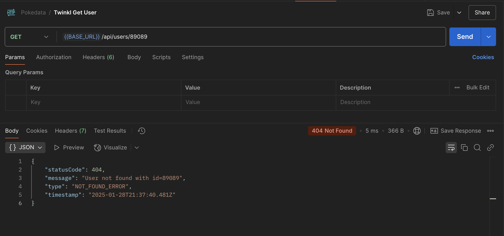

## Overview

A simple TypeScript application showcasing best practices in structure, validation, logging, and error handling.

---

## Libraries Used

- **sqlite**, **sqlite3**: For lightweight database storage.
- **joi**: For input validation.
- **pino**: For logging.
- **bcrypt**: For password encryption.

---

## Run the App

1. **Install Dependencies**  
   Install the necessary dependencies:  
   ```bash
   npm install
   ```
2. **Run in Development Mode**  
   Start the application in development mode. This will automatically create a lightweight SQLite database if it does not already exist:  
   ```bash
   npm run dev
   ```
3. **Run Unit Tests**  
   ```bash
   npm run test
   ```

3. **Run Api Tests**  
    ```bash
    npm run test:api
    ```
4. **Build the app**  
    ```bash
    npm run build 
    ```

## App Screenshots

- **Validation of the POST /users API(with validation criteria defined)** 


- **Get single user by ID (validation and error handling.)** 




- **API Tests**


- **Unit Tests**


---

## Error Handling

- A centralized error handling middleware is added in order to keep the structure of the errors consistent with message, type, and status code. This ensures it can be used by front-end or other apps that may consume the app and expect consistent error messaging. We have also added error logging so that we can monitor the app logs over time and address bugs and issues through the logs.

---

## Questions and Answers

### Was the entire structure (middleware and folders) an overkill for only 2 endpoints? Why was it not just done in `index.ts`?
- Although it may seem like an overkill to separate everything for such a small app and add middleware, this is done with the mindset that the application will grow. Having a structured codebase makes the app more maintainable, readable, and testable in the long run.

### Why was Joi used instead of building in-house validation?
- Joi was used instead of in-house validation as it supports most major types of validation (emails, numbers, names, etc.). This allows us to save time and focus on app development rather than constantly updating in-house validation rules. Additionally, Joi is a highly tested library already.

### Why was the password hashed and omitted from the response in both the creation and "get by ID" endpoints?
- In a real-world scenario, passwords would never be stored in their raw format in the database due to security concerns, so they have been hashed. The password is omitted from the API return JSON as it is a bad practice to return the password for security reasons. The password is only used for user profile verification.
